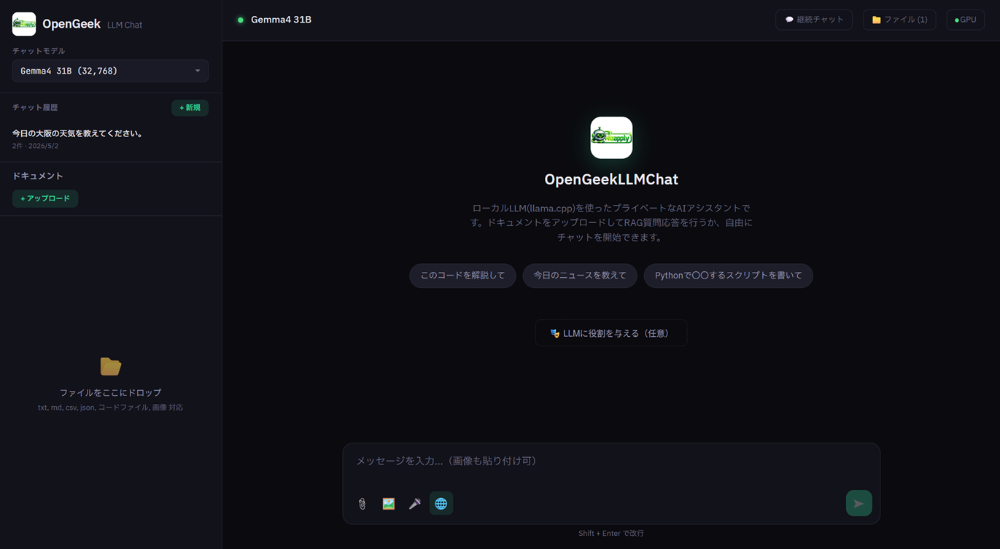

# OpenGeekLLMChat

<div align="center">
ギークのためのブラウザベース・ローカルLLMチャットアプリ。クラスタやGPU監視などが可能。
Ollama と React 1ファイル、Node.js サーバー1ファイル。ビルド不要、依存は最小。

[](LICENSE)
[](https://nodejs.org/)
[](https://ollama.com/)
[](#)
[](#)

<!-- スクリーンショット -->


</div>

---

## 🎯 何ができるのか

OpenGeekLLMChatは、**クラウドに依存しないローカルLLM環境を自宅サーバーや社内LANで動かすため** に設計されたチャットアプリです。ギークが自由に弄り倒せるよう、**依存を最小限に絞り、すべてがファイル1枚で完結する構成** になっています。

- サーバー: `server.js` 1ファイル（依存は `express` と `ws` のみ）
- クライアント: `public/index.html` 1ファイル（React/Babel CDN、ビルドツール不要）
- GPU監視エージェント: `gpu-agent.js` 1ファイル（依存ゼロ）

データは全て手元に残ります。**クラウドAPIへの送信は一切ありません。**

---

## ✨ 主な機能

### 🤖 Agentic RAG（マルチターン対応）
LLMが自ら検索要否を判断し、必要なときだけドキュメントRAG・Web検索・ファイル操作を呼び出します。最大3ターンのツール実行ループで、「一覧取得 → 内容読み込み → 応答」の段階的処理が可能。

### 🌐 DuckDuckGo Web検索（本文取得対応）
APIキー不要。検索結果のスニペットだけでなく、上位3件のページ本文も自動取得。天気・ニュース・株価なども回答可能。

### 📁 サーバーファイル読み書き
LLMが直接サーバーのファイルシステムに `.py` / `.xml` / `.json` 等を保存可能。Agenticツールとして `read_file`, `write_file`, `list_files` を実装。バイナリファイル（PNG/PDF/Parquet等）もFormData経由で安全にアップロード・ダウンロード可能。

### 🎯 ドラッグ&ドロップ統合UI
3つのドロップゾーンが状況に応じて自動で振り分け:
- **チャット入力欄**: 画像→Vision添付、その他→ドキュメント取り込み
- **左サイドバー（ドキュメント）**: RAG用ドキュメントとして取り込み（embedding生成）
- **右サイドバー（サーバーファイル）**: `public/uploads/` にバイナリ含めて保存

### 🌐 Web検索ON/OFFトグル
チャット入力欄の🌐ボタンで検索の有効/無効を即座に切り替え可能。社内ドキュメントだけで答えてほしい時はOFF、最新情報が必要な時はONに。デフォルトは `config.webSearch` で設定。

### 📐 履歴の重み付け（直近優先）
直近6件のメッセージはそのまま送信、それ以前は「参考情報」として圧縮、最新ユーザー質問には「今この質問に回答してください」マーカーを付加。長い会話でも最新文脈を確実に優先させます。`config.recentMessageCount` で件数調整可能。

### ⚡ マルチGPU・複数PC負荷分散
複数のOllamaインスタンス（別GPU / 別PC）を **GPU使用率 + アクティブ接続数** で自動振り分け。軽量GPU監視エージェント（`gpu-agent.js`）を各PCに配置すれば、統合GPUモニターが全PC分のGPU状態を1画面で表示。

### 🖼️ Vision対応
gemma3 / llava 等のビジョンモデルに画像を直接送信。ペースト・D&D・アップロードに対応。

### 📊 matplotlib グラフ自動表示
`plt.show()` や `plt.savefig()` を呼ぶだけで、生成画像がチャットにインライン表示されます。日本語フォントも自動選択。生成画像は `public/plots/` に分離保存されるため、`list_files` でLLMの作業領域を汚しません。チャット内の **📎 チャットに添付** ボタンで、生成したグラフを次のチャット入力に画像として渡せます（Visionモデルとの連携）。

### 🦆 DuckDB 対応（高速SQL処理）
CSV / Parquet / JSON ファイルを直接SQLでクエリ可能。pandasより高速・省メモリで数百万行のデータを扱えます。LLMが大量データの集計依頼を受けたときに自動的にDuckDBコードを生成します。

### 🎮 Three.js / HTMLプレビュー
LLMが生成したThree.jsコードをチャット内でワンクリック実行。CDN自動注入・ESM→UMD変換・壊れたCDN URL自動修正。

### 🐍 Python対話実行
コードブロックの「▶ 実行」で対話的実行。`input()` 入力も可能。matplotlibでのグラフ描画自動対応。作業ディレクトリはuploads配下でLLMツールと統一。

### 🎤 音声入力 (Web Speech API)
マイクボタンから日本語音声認識。リアルタイムで入力欄に反映。**3秒無音で自動送信**、送信後は録音自動停止。

### 🔊 音声出力 (Web Speech Synthesis)
アシスタントメッセージ下の🔊ボタンでOS内蔵TTSでの読み上げ。Markdown記号・コードブロック自動除去。別メッセージ切替・チャット切替時は自動停止。

### 📈 リアルタイムメトリクス
トークン生成速度（tok/s）、コンテキスト使用率（%バー）、GPU使用率/温度/電力/VRAM を右サイドバーにリアルタイム表示。

### 🔄 思考中断からの復旧 / ループ検出
Thinking中にモデルが停止した場合、メッセージ下の「🔄 続きを生成」ボタンで自動的に続きを要求できます。さらに、**同じ思考が3回繰り返されると自動的にループを検出して停止**し、「⚠️ 思考ループを中断・回答を要求」ボタンが表示されます。小型モデルの暴走を未然に防げます。

### ⏹️ 確実な生成停止
停止ボタン押下時、HTTPストリーム切断に加えて、Ollamaに `keep_alive: 0` を送信してモデルをアンロードします。GPU使用率も即座にゼロになります。

### ⚡ ツール判断の高速化
ツール（search_documents/web_search 等）を呼ぶか判断するフェーズでは `think: false` を指定し、思考プロセスをスキップして即座に判定。応答速度向上＆思考ループ防止を兼ねた効果あり。

### 📱 モバイル対応（2行ヘッダー）
スマートフォンサイズでは自動的にヘッダーを2行レイアウトに切替。`100dvh` + iOSセーフエリア対応で、アドレスバー表示時もホームバー被りも回避。チャット入力欄は16pxフォントでiOSフォーカス時の自動ズームを抑制。

### 🔒 セキュリティ
- **HTTPS対応**: `cert.pem` / `key.pem` を配置で自動HTTPS起動。正規SSL証明書（Let's Encrypt等）も利用可能
- セッションCookie認証（HttpOnly + SameSite=Strict + Secure自動付与、24h TTL）
- **Cookie維持で再ログイン不要**（TTL以内）
- MD5/SHA-256ハッシュ（`crypto.timingSafeEqual` 使用）
- ログイン試行レートリミット（15分5回）
- パストラバーサル対策
- 全認証必須エンドポイント

### 🛠️ その他
- Markdown / LaTeX（KaTeX）/ コードハイライト（highlight.js）
- Thinking表示（DeepSeek R1 / gemma3等の `<think>` タグ対応）
- チャット履歴保存（メッセージ+ドキュメント+Embedding）
- チャットタイトル編集
- ストリーミング中のスクロール制御（ユーザーが上にスクロールしたら自動追従停止）
- systemd対応（`process.chdir(__dirname)` で起動位置非依存）
- レスポンシブ・ダークテーマ
- 全設定を `config.json` でカスタマイズ可能

---

## 🚀 クイックスタート

### 1. Ollama

```bash
curl -fsSL https://ollama.com/install.sh | sh
ollama pull gemma3:12b            # お好みのチャットモデル
ollama pull mxbai-embed-large     # RAG用Embedding（必須）
```

### 2. Node.js（未インストールの場合）

```bash
# Ubuntu / Debian
curl -fsSL https://deb.nodesource.com/setup_22.x | sudo -E bash -
sudo apt install -y nodejs

# macOS
brew install node

# Windows: https://nodejs.org/ からLTS版をDL
```

### 3. Python・matplotlib・DuckDB（任意）

```bash
# Ubuntu / Debian
sudo apt install python3-matplotlib python3-numpy python3-pandas fonts-ipaexfont fonts-noto-cjk
rm -rf ~/.cache/matplotlib  # フォントキャッシュ更新

# DuckDB（大量データのSQL処理）
pip3 install duckdb --break-system-packages

# まとめてpipで
pip3 install matplotlib numpy pandas duckdb --break-system-packages
```

DuckDB はLLMが大量データのSQL集計を求められたときに自動的に使用します（CSV/Parquetを直接FROMで参照、pandasのDataFrameもSQL対象に）。

### 4. 起動

```bash
git clone https://github.com/<your-username>/opengeek-llm-chat.git
cd opengeek-llm-chat
npm install
npm start
```

ブラウザで **http://localhost:3000**

### 5. HTTPS化（任意・推奨）

**自己署名証明書で試す:**
```bash
./generate-cert.sh localhost 192.168.1.100 your-hostname
npm start    # 起動バナーが https:// になる
```

**正規SSL証明書を使う（Let's Encrypt等）:**
```bash
# 証明書を cert.pem と key.pem として配置
cp /path/to/fullchain.pem cert.pem
cp /path/to/privkey.pem key.pem
chmod 600 key.pem
# 秘密鍵にパスフレーズがある場合は事前に解除
# openssl rsa -in key.pem -out key.pem
npm start
```

HTTPS化すると、マイク・音声合成・クリップボード等のブラウザAPI制約が全て解消されます。

---

## 📁 リポジトリ構成

```
opengeek-llm-chat/
├── server.js                   # Express + WebSocket（依存最小）
├── gpu-agent.js                # リモートGPU監視エージェント（依存ゼロ）
├── generate-cert.sh            # 自己署名SSL証明書生成スクリプト
├── hashpass.py                 # パスワードハッシュ生成ツール
├── config.json                 # 全設定
├── package.json                # express + ws のみ
├── opengeek-llm-chat.service   # systemdサービステンプレート
├── transcribe-server.py        # Gemma4 E2B音声認識サーバー（参考実装・非推奨）
├── TRANSCRIBE.md               # 音声認識セットアップガイド（参考）
├── cert.pem / key.pem          # SSL証明書（配置時にHTTPSモード起動）
├── public/
│   ├── index.html              # React SPA（単一ファイル）
│   ├── aiicon.jpg              # アイコン（任意）
│   ├── uploads/                # LLMが読み書きするディレクトリ
│   │                           #  （Python実行の作業ディレクトリでもある）
│   └── plots/                  # matplotlibが自動生成した画像（list_filesから除外）
├── chats/                      # チャット履歴JSON（自動生成）
├── settings.json               # ユーザー設定（自動生成）
├── DESIGN.md                   # 設計ドキュメント
├── README.md                   # これ
└── LICENSE                     # MIT
```

---

## ⚙️ config.json

全ての挙動は `config.json` で制御できます。

```json
{
  "appName": "OpenGeekLLMChat",
  "logoMain": "OpenGeek",
  "logoSub": "LLM Chat",
  "accentColor": "#34d399",
  "defaultModel": "",
  "embedModel": "mxbai-embed-large:latest",
  "password": "",
  "pythonPath": "python3",
  "gpuAgentToken": "",
  "ollamaBackends": [],
  "webSearch": true,
  "fileAccess": true,
  "ragTopK": 10,
  "ragMode": "agentic",
  "agentContext": {
    "smallCtx": 2048,
    "mediumCtx": 8192,
    "smallPredict": 512,
    "largePredict": 8192,
    "smallThreshold": 2000,
    "mediumThreshold": 8000,
    "judgeHistoryCount": 3,
    "largeGenKeywords": null
  },
  "tokenAvgWindow": 2000,
  "recentMessageCount": 6,
  "topK": 40, "topP": 0.9, "temperature": 0.7
}
```

| キー | 説明 |
|:--|:--|
| `appName` / `logoMain` / `logoSub` | 表示名・ロゴ |
| `accentColor` | テーマカラー（HEX） |
| `defaultModel` | 初期モデル（空→一覧先頭を自動選択） |
| `embedModel` | RAG用Embeddingモデル（チャット選択肢からは自動除外） |
| `password` | MD5/SHA-256ハッシュ（空→認証なし） |
| `pythonPath` | Python実行時のコマンド（venv対応、例: `.venv/bin/python3`） |
| `gpuAgentToken` | gpu-agent共有トークン |
| `ollamaBackends` | 複数バックエンド配列（後述） |
| `webSearch` | DuckDuckGo検索 ON/OFF |
| `fileAccess` | サーバーファイル読み書き ON/OFF |
| `ragTopK` | RAG検索チャンク数 |
| `ragMode` | `agentic` / `always` |
| `agentContext.*` | ツール判断時の動的ctx/predict調整 |
| `recentMessageCount` | 直近何件のメッセージを「そのまま」送信するか（それ以前は「参考情報」化）デフォルト6 |
| `systemPrompts.*` | システムプロンプトのカスタマイズ（後述） |
| `topK`/`topP`/`temperature` | LLM推論パラメータ |

### 🎨 systemPrompts のカスタマイズ

LLMへの指示文を `config.json` の `systemPrompts` キーで完全カスタマイズ可能。`{date}` は実時間で、`{docList}` はドキュメント名カンマ区切りで、`{toolList}` は利用可能ツール一覧で動的に展開されます。

```json
{
  "systemPrompts": {
    "base": "あなたは親切で知識豊富なAIアシスタントです。日本語で簡潔に回答してください。今日の日付は{date}です。\n\n重要な指示:\n- 思考は手短に済ませ...",
    "documents": "【参照可能なドキュメント】(チャットに添付されたファイル): {docList}\nユーザーの質問が「ドキュメントについて」「資料を見て」「添付ファイル」などを示唆する場合、必ず最初に search_documents ツールを使ってください。",
    "webSearch": "最新の情報や知らないことについては web_search ツールでインターネット検索できます。",
    "fileAccess": "【サーバーファイル操作】(uploads配下、ドキュメントとは別物)\n- list_files: uploadsフォルダの一覧を取得\n...",
    "python": "Pythonコード実行について:\n- 応答に ```python ... ``` のコードブロックを含めると...",
    "meta": "重要な指示:\n- 内部的な推論・検索戦略・計画・メタ的な説明は一切出力しないでください...",
    "judge": "以下の中から必要なツールを呼び出してください...\n{toolList}\n注意:..."
  }
}
```

部分的に上書きすることもできます（指定しないキーはデフォルトが使用される深いマージ）。例えば「役割」だけ変えたい場合:

```json
{
  "systemPrompts": {
    "base": "あなたは社内文書専門のアシスタントです。質問には必ず添付ドキュメントから根拠を引用して回答してください。今日の日付は{date}です。"
  }
}
```

| キー | 用途 | 利用可能変数 |
|:--|:--|:--|
| `base` | 全フェーズ共通の土台 | `{date}` |
| `documents` | ドキュメント添付時の追記 | `{docList}` |
| `webSearch` | Web検索有効時の追記 | - |
| `fileAccess` | サーバーファイル操作有効時の追記 | - |
| `python` | Python実行案内（常時） | - |
| `meta` | メタ抑制指示（常時） | - |
| `judge` | ツール判断専用（軽量） | `{toolList}` |

---

## 🔒 パスワード認証

```bash
# MD5ハッシュ生成
python3 hashpass.py mysecret
# → "098f6bcd..."
```

```json
"password": "098f6bcd4621d373cade4e832627b4f6"
```

サーバー再起動でログイン画面が表示されます。空文字で認証解除。

---

## ⚡ マルチGPU・複数PC構成

10台のPCでロードバランスする例。

### 各PCで Ollama + gpu-agent 起動

```bash
# Ollama (全PC)
OLLAMA_HOST=0.0.0.0:11434 ollama serve

# gpu-agent (全PC)
GPU_AGENT_TOKEN=mysecret123 node gpu-agent.js
```

### フロントサーバーのconfig.json

```json
{
  "gpuAgentToken": "mysecret123",
  "ollamaBackends": [
    { "host": "192.168.10.0", "port": 11434, "label": "node-0" },
    { "host": "192.168.10.1", "port": 11434, "label": "node-1" },
    { "host": "192.168.10.2", "port": 11434, "label": "node-2" }
  ]
}
```

### 振り分けアルゴリズム

```
score = avg(GPU_usage) + active_connections × 30
→ 最小スコアのバックエンドを選択
```

- GPUが複数枚あるPCも自動認識
- リモートPCダウン時はキャッシュを保持し、UIはちらつかない
- 右サイドバーのGPUタブに全PC分のGPUが並んで表示

### 1台で複数GPU

```bash
CUDA_VISIBLE_DEVICES=0 OLLAMA_HOST=0.0.0.0:11434 ollama serve
CUDA_VISIBLE_DEVICES=1 OLLAMA_HOST=0.0.0.0:11435 ollama serve
```

`ROCR_VISIBLE_DEVICES` はROCm（AMD）用。

---

## 🧠 Agentic RAG の仕組み

```
ユーザー: "今日のニュース教えて"
  ↓
LLM: 🌐 web_search("2026年4月14日 主要ニュース") → 5件取得
  ↓
LLM: 検索結果を元に回答生成（ストリーミング）

ユーザー: "このdata.jsonを要約して"
  ↓
LLM: 📁 read_file("data.json") → 内容取得
  ↓
LLM: 要約してストリーミング応答

ユーザー: "cube_sim.py に物理シミュレーションコードを保存"
  ↓
LLM: ✍️ write_file("cube_sim.py", "...長いコード...") → 保存完了
  ↓
LLM: 保存しましたと応答 + コード解説
```

LLMが自分で判断してツールを呼びます。プロンプトに「検索してから回答しろ」と書く必要はありません。

---

## 🧪 環境変数

| 変数名 | デフォルト | 説明 |
|:--|:--|:--|
| `PORT` | `3000` | HTTPサーバーポート |
| `OLLAMA_HOST` | `127.0.0.1` | Ollama API（単一構成時） |
| `OLLAMA_PORT` | `11434` | 同上 |
| `PYTHON_TIMEOUT` | `60000` | Python実行タイムアウト(ms) |
| `GPU_INTERVAL` | `1000` | GPU監視間隔(ms) |
| `CHATS_DIR` | `./chats` | チャット履歴保存先 |

---

## 📡 API

| Method | Path | Auth | 説明 |
|:--|:--|:--:|:--|
| `*` | `/api/*` | ✓ | Ollamaリバースプロキシ（負荷分散） |
| `GET` | `/web-search?q=&n=&fetch=&bodyCount=` | ✓ | DuckDuckGo検索+本文取得 |
| `GET/POST` | `/files/*` | ✓ | サーバーファイル読み書き（画像等はバイナリ配信） |
| `DELETE` | `/files/*` | ✓ | ファイル削除 |
| `GET` | `/files` | ✓ | ファイル一覧 |
| `GET` | `/plots/*` | ✓ | matplotlib生成画像の配信（uploadsとは分離管理） |
| `GET` | `/config` | — | 公開設定（セッション有効時は `authenticated:true`） |
| `POST` | `/auth` | — | ログイン（Cookie発行・24h TTL） |
| `GET` | `/sse/gpu` | ✓ | GPU監視 SSE |
| `GET/POST` | `/settings` | ✓ | ユーザー設定 |
| `GET/POST/DELETE` | `/chats/:id` | ✓ | チャット履歴 |
| `WS` | `/ws/python` | ✓ | Python対話実行（画像生成対応） |

---

## 🖥️ デプロイ（systemd）

### OpenGeekLLMChat 本体

テンプレートファイル `opengeek-llm-chat.service` が同梱されています:

```bash
# 内容を確認・編集（User, WorkingDirectory, ExecStart等を環境に合わせる）
sudo cp opengeek-llm-chat.service /etc/systemd/system/
sudo nano /etc/systemd/system/opengeek-llm-chat.service

# 有効化・起動
sudo systemctl daemon-reload
sudo systemctl enable --now opengeek-llm-chat

# ログ確認
sudo journalctl -u opengeek-llm-chat -f
```

`process.chdir(__dirname)` により、systemd経由で起動してもカレントディレクトリは自動的にserver.jsと同じ場所になります。

### GPU Agent（各ノード）

```ini
# /etc/systemd/system/gpu-agent.service
[Unit]
Description=GPU Agent
After=network.target

[Service]
Type=simple
User=your-user
ExecStart=/usr/bin/node /path/to/gpu-agent.js
Restart=always
Environment=GPU_AGENT_TOKEN=mysecret123

[Install]
WantedBy=multi-user.target
```

```bash
sudo systemctl daemon-reload
sudo systemctl enable --now opengeek-llm-chat gpu-agent
```

---

## 🛠️ 技術スタック

| Layer | Tech |
|:--|:--|
| Frontend | React 18 (CDN/Babel) · marked · highlight.js · KaTeX · Three.js r128 · Web Speech API (STT/TTS) |
| Backend | Node.js · Express · ws（依存2つのみ）· HTTPS対応 |
| AI | Ollama · mxbai-embed-large · Tool Calling · マルチターン実行 |
| Python | matplotlib（画像自動表示）· 日本語フォント自動選択 · DuckDB（SQL処理） |
| Search | DuckDuckGo HTML Lite + 本文取得 |
| Auth | セッションCookie (24h) · MD5/SHA-256 + timingSafeEqual · HTTPS時Secure自動付与 |
| GPU監視 | rocm-smi / nvidia-smi |

---

## 🤝 Contributing

PR大歓迎。ギーク的な改造ほど歓迎します。

---

## 📝 ライセンス

[MIT](LICENSE)   
※一部はAIによって生成されています。
